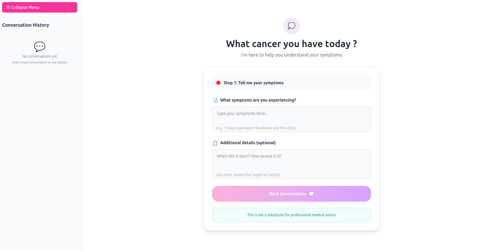
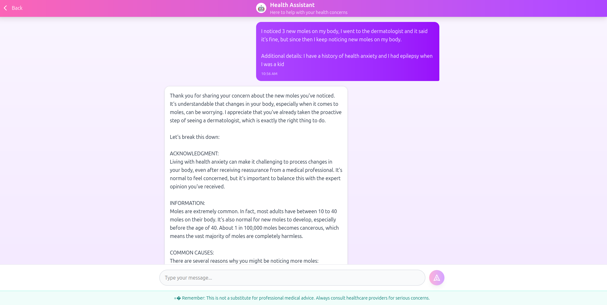
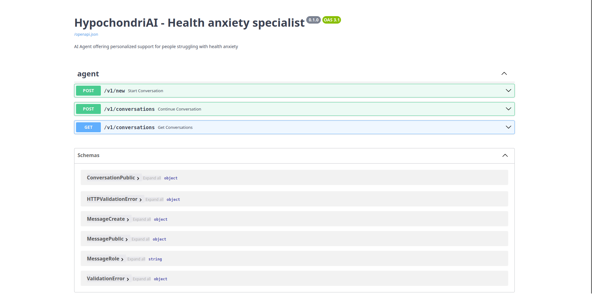

<div class="title-block" style="text-align: center;" align="center">

# HyphochondriaAI - Health Anxiety Specialist

<div align="center">
  
</div>

[](https://github.com/Mihai-Tirtara/HypochondriAI)
[](https://www.python.org/downloads/)
[](https://fastapi.tiangolo.com/)
[](LICENSE)
</div>


## Introduction
HyphochondriaAI is a multi-agent chatbot designed to provide compassionate support and evidence-based information for individuals experiencing health anxiety. Built with modern web technologies and powered by advanced language models, it offers a safe space for users to explore their health concerns while promoting healthy coping mechanisms and encouraging appropriate medical consultation when necessary.


## Technology Stack & Features 

- ⚡ **[FastAPI](https://fastapi.tiangolo.com)** for the Python backend API
  - 🧰 **[SQLModel](https://sqlmodel.tiangolo.com)** for database interactions (ORM)
  - 🔍 **[Pydantic](https://docs.pydantic.dev)** for data validation and settings management
  - ✅ **[Pytest](https://pytest.org)** for comprehensive testing
  - 🔄 **[Alembic](https://alembic.sqlalchemy.org/)** for database migrations
  - 💾 **[PostgreSQL](https://www.postgresql.org)** as the SQL database
  - 🔠  💾 **[Ruff](https://github.com/astral-sh/ruff)** and **[Black](https://github.com/psf/black)** for linting and formatting 
  
- 🚀 **[React](https://react.dev)** for the frontend
  - 💃 Using TypeScript, hooks, Vite, and other parts of a modern frontend stack.
  - 🎨 **[TailwindCSS](https://tailwindcss.com/)** for responsive design
  - 📱 An automatically generated frontend client
  - 🐕‍🦺 **[Husky](https://typicode.github.io/husky/)** with ESLint as Git hook 

- 🤖 **[LangChain](https://langchain.com)** for LLM framework 
  - 🌐 **[LangGraph](https://langgraph.com)** for agent creation and conversation memory
  - ☁️ **[AWS Bedrock](https://aws.amazon.com/bedrock/)** for AI model access
  - 🦾 **[Claude](https://claude.ai/new)** as the AI model 
- 🏭 CI (continuous integration)  based on GitHub Actions.


### Main Page 
[](https://github.com/Mihai-Tirtara)

### Conversation Page
[](https://github.com/Mihai-Tirtara)

### Interactive documentation
[](https://github.com/Mihai-Tirtara)


## Installation

Follow these steps to set up and run the application locally:

### 1. Environment Setup

```bash
# Ensure you have Python 3.12+ and Node.js installed
# PostgreSQL database will need to be created beforehand 
```

### 2. Backend Service (Python FastAPI)

```bash
# Navigate to the backend directory
cd backend/app

# Create and activate virtual environment
python -m venv venv
source venv/bin/activate  # On Windows, use: venv\Scripts\activate

# Install dependencies
pip install -r requirements.txt

# Set up environment variables in .env file
# Example:
AWS_ACCESS_KEY_ID=your_access_key
AWS_SECRET_ACCESS_KEY=your_secret_key
AWS_REGION=your_aws_region
MODEL_ID=anthropic.claude-3-5-sonnet-20240620-v1:0
DB_USERNAME=your_db_user
DB_PASSWORD=your_db_password
DB_NAME=health_anxiety

# Start the FastAPI server
fastapi dev
```

### 3. Frontend (React) 

```bash
# Navigate to the frontend directory
cd frontend

# Install dependencies
npm install

# Start the development server
npm run start
```

## Development Roadmap 

### Phase 1: Advanced AI Architecture 🚀
**Multi-Agent System Implementation**

Implementing a multi-agent architecture using [LangGraph's Hierarchical Agent Teams](https://langchain-ai.github.io/langgraphjs/tutorials/multi_agent/hierarchical_agent_teams/) to create specialized AI agents for different aspects of health anxiety support
- **Supervisor Agent**: Orchestrates conversation flow and routes queries to specialized agents
- **Medical Team**: Retrieving up-to date medical information
- **mental Health Team**: Offering support and techniques for reducing anxiety 

**Agentic RAG Integration**: Each  agent will leverage retrieval-augmented generation to access curated health anxiety resources, medical literature, and therapeutic techniques.

### Phase 2: Enhanced Retrieval Systems 🔍
**Corrective RAG (CRAG) Implementation**

Building on the foundation, we'll implement [Corrective RAG using LangGraph](https://langchain-ai.github.io/langgraphjs/tutorials/rag/langgraph_crag/) to ensure information accuracy and relevance:

- **Self-Correcting Retrieval**: System evaluates retrieved information quality and re-queries if needed
- **Multi-Source Validation**: Cross-references information from multiple authoritative health sources
- **Relevance Scoring**: Advanced filtering to ensure responses are contextually appropriate
- **Fallback Mechanisms**: Graceful handling when high-quality information isn't available

### Phase 3: ML Operations & Monitoring 📊
**MLflow Integration**

Implementing comprehensive ML operations using [MLflow for GenAI](https://mlflow.org/docs/latest/genai/) to ensure model performance and reliability:

- **Model Versioning**: Track and manage different agent configurations and prompt versions
- **Performance Monitoring**: Real-time tracking of response quality, user satisfaction, and safety metrics
- **A/B Testing**: Systematic testing of different agent behaviors and response strategies
- **Experiment Tracking**: Comprehensive logging of model experiments and hyperparameter tuning
- **Model Registry**: Centralized management of production-ready agent models

### Phase 4: Containerization & Deployment 🐋
**Docker & AWS Infrastructure**

- **Containerization**: Complete Docker setup for development and production environments
- **AWS ECS/Fargate**: Scalable container orchestration
- **Load Balancing**: Auto-scaling based on user demand
- **Database Migration**: Managed PostgreSQL on AWS RDS
- **CDN Integration**: CloudFront for optimal frontend performance
- **Monitoring & Logging**: CloudWatch integration for comprehensive observability

### Phase 5: Production Readiness 🏭
**Advanced Features & Optimization**

- **User Authentication**: Secure session management and user profiles
- **Advanced Analytics**: Conversation insights and usage patterns
- **Multi-language Support**: Internationalization for broader accessibility
- **Mobile Applications**: Native iOS and Android apps
- **Health API Integrations**: Connect with popular health tracking platforms
- **Compliance**: HIPAA-aligned privacy and security measures

## License

This project is licensed under the GPL 3.0 License - see the LICENSE file for details.
