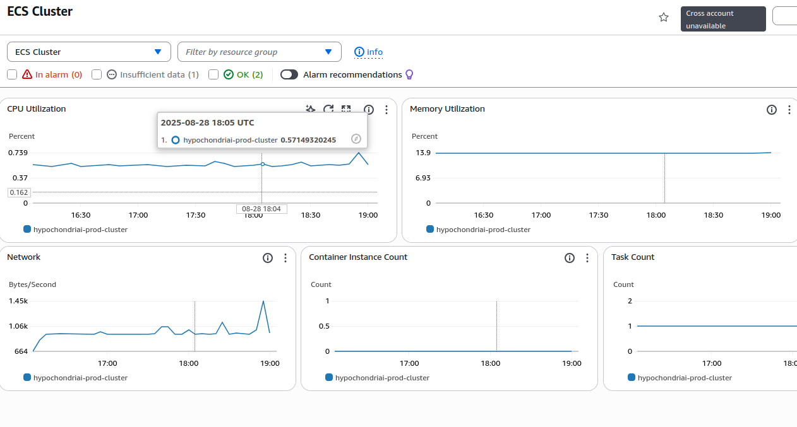

<div class="title-block" style="text-align: center;" align="center">

# HyphochondriaAI - Health Anxiety Specialist

<div align="center">
  
</div>

[](https://github.com/Mihai-Tirtara/HypochondriAI)
[](https://www.python.org/downloads/)
[](https://fastapi.tiangolo.com/)
[](LICENSE)
</div>


## Introduction
HyphochondriaAI is a chatbot designed to provide compassionate support and evidence-based information for individuals experiencing health anxiety. Built with modern web technologies and powered by advanced language models, it offers a safe space for users to explore their health concerns while promoting healthy coping mechanisms and encouraging appropriate medical consultation when necessary.


## Technology Stack & Features

- ⚡ **[FastAPI](https://fastapi.tiangolo.com)** for the Python backend API
  - 🧰 **[SQLModel](https://sqlmodel.tiangolo.com)** for database interactions (ORM)
  - 🔍 **[Pydantic](https://docs.pydantic.dev)** for data validation and settings management
  - ✅ **[Pytest](https://pytest.org)** for comprehensive testing
  - 🔄 **[Alembic](https://alembic.sqlalchemy.org/)** for database migrations
  - 💾 **[PostgreSQL](https://www.postgresql.org)** as the SQL database
  - 🔠 **[Ruff](https://github.com/astral-sh/ruff)** and **[Black](https://github.com/psf/black)** for linting and formatting

- 🚀 **[React](https://react.dev)** for the frontend
  - 💃 Using TypeScript, hooks, Vite, and other parts of a modern frontend stack.
  - 🎨 **[TailwindCSS](https://tailwindcss.com/)** for responsive design
  - 📱 An automatically generated frontend client
  - 🐕‍🦺 **[Husky](https://typicode.github.io/husky/)** with ESLint as Git hook

- 🤖 **[LangChain](https://langchain.com)** for LLM framework
  - 🌐 **[LangGraph](https://langgraph.com)** for agent creation and conversation memory
  - ☁️ **[AWS Bedrock](https://aws.amazon.com/bedrock/)** for AI model access
  - 🦾 **[Claude](https://claude.ai/new)** as the AI model
- 🏭 CI/CD pipeline with GitHub Actions.
- 🐋 [Docker Compose](https://www.docker.com) for development and production.


### Main Page
[](https://github.com/Mihai-Tirtara)

### Conversation Page
[](https://github.com/Mihai-Tirtara)

### Interactive documentation
[](https://github.com/Mihai-Tirtara)

## AWS Cloud Architecture
[](https://github.com/Mihai-Tirtara)

 - ☁️ **[ECS](https://aws.amazon.com/ecs/)** with Fargate for serverless container orchestration
    - 🐳 **[ECR](https://aws.amazon.com/ecr/)** for Docker image registry
    - 🔐 **[Secrets Manager](https://aws.amazon.com/secrets-manager/)** for secure credential storage
    - 📊 **[Cloudwatch](https://aws.amazon.com/cloudwatch/)** for monitoring and logging
    - 🔄 Auto-scaling and health checks with circuit breaker deployment
  - 🌐 **[CloudFront](https://aws.amazon.com/cloudfront/)** global CDN for frontend delivery
    - 🪣 **[S3](https://aws.amazon.com/s3/)** for static website hosting
    - 🔒 Origin Access Control (OAC) for secure bucket access
    - ⚡ Custom caching policies for optimal performance
  - 📡 **[Amazon VPC](https://docs.aws.amazon.com/vpc/latest/userguide/what-is-amazon-vpc.html)** - Custom virtual private cloud with public/private subnets
    - 🏗️ **[ALB](https://aws.amazon.com/elasticloadbalancing/)** for HTTP/HTTPS traffic distribution
    - 🔓 VPC Endpoints - Private connectivity to AWS services:
    - 🔐 **[ACM](https://aws.amazon.com/certificate-manager/)** for SSL/TLS certificates
    - 🛡️ Security groups and network isolation
  - 🗄️ **[RDS](https://aws.amazon.com/rds/postgresql/)** managed database
    - 🔄 Multi-AZ deployment for high availability
    - 📈 Performance Insights and enhanced monitoring
    - 🔐 Encrypted storage and automated backups
  - 🤖 **[Terraform](https://terraform.io)** for Infrastructure as Code
    - 📝 S3 backend with DynamoDB state locking
    - 🚀 Automated deployment scripts


## ECS Cluster Metrics
[](https://github.com/Mihai-Tirtara)

## ECS Log Events
[](https://github.com/Mihai-Tirtara)

## RDS Metrics
[](https://github.com/Mihai-Tirtara)

## ALB Metrics
[](https://github.com/Mihai-Tirtara)

## Cloudwatch Alarms
[](https://github.com/Mihai-Tirtara)

## Installation

Follow these steps to set up and run the application locally:

### 1. Environment Setup

```bash
# Ensure you have Python 3.12+ and Node.js installed
# PostgreSQL database will need to be created beforehand
```

### 2. Backend Service (Python FastAPI)

```bash
# Navigate to the backend directory
cd backend/app

# Create and activate virtual environment
python -m venv venv
source venv/bin/activate  # On Windows, use: venv\Scripts\activate

# Install dependencies
pip install -r requirements.txt

# Set up environment variables in .env file
# Example:
AWS_ACCESS_KEY_ID=your_access_key
AWS_SECRET_ACCESS_KEY=your_secret_key
AWS_REGION=your_aws_region
MODEL_ID=anthropic.claude-3-5-sonnet-20240620-v1:0
DB_USERNAME=your_db_user
DB_PASSWORD=your_db_password
DB_NAME=health_anxiety

# Start the FastAPI server
fastapi dev
```

### 3. Frontend (React)

```bash
# Navigate to the frontend directory
cd frontend

# Install dependencies
npm install

# Start the development server
npm run start
```

### 4. Docker Set-up

```bash
# Create a .env file in the root folder with folowing variables
#Example:

# Database Configuration
DB_NAME=your_db_name
DB_USERNAME=your_db_username
DB_PASSWORD=your_db_password
DB_HOST=postgres
DB_PORT=5432

# Superuser Configuration
DB_SUPERUSER_USERNAME=your_superuser_name
DB_SUPERUSER_PASSWORD=your_superuser_password
DB_SUPERUSER_EMAIL=your_superuser_email

# AWS Configuration
AWS_ACCESS_KEY_ID=your_aws_acces_key
AWS_SECRET_ACCESS_KEY=your_aws_secret_acces
AWS_REGION=your_aws_region

# Bedrock Configuration
MODEL_ID=your_model_of_choice
MODEL_PROVIDER=bedrock_converse
MAX_TOKENS=1000
TEMPERATURE=0.3
TOP_P=0.4

# API Configuration
API_HOST=0.0.0.0
API_PORT=8000
LOG_LEVEL=INFO
API_PREFIX=/api/v1

# App settings
APP_NAME=HypochondriAI - Health anxiety specialist
APP_VERSION=0.1.0
APP_DESCRIPTION=AI Agent offering personalized support for people struggling with health anxiety

# The application can now be started locally with a single command
docker compose up --build
```


## License

This project is licensed under the GPL 3.0 License - see the LICENSE file for details.
